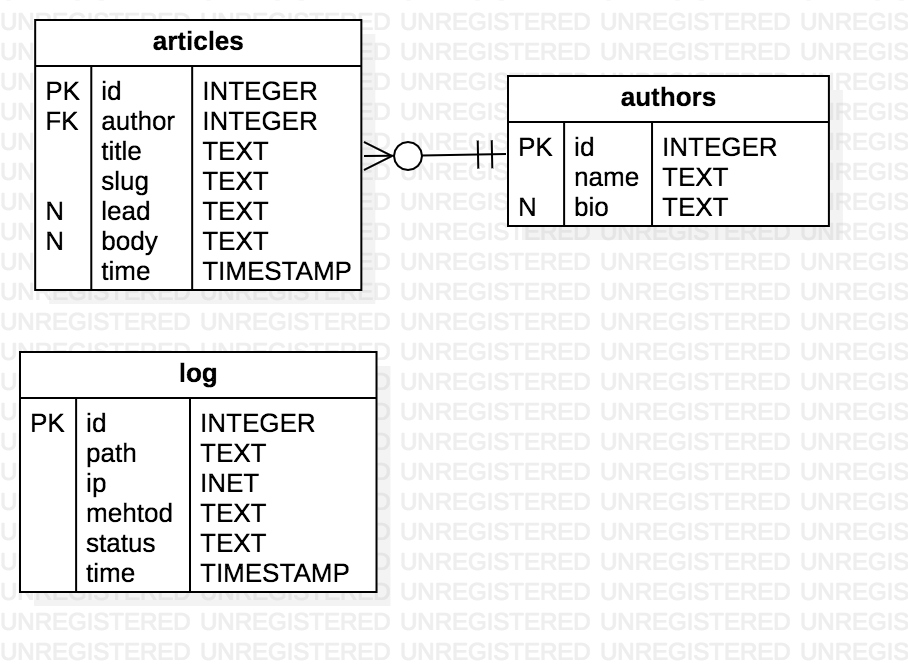
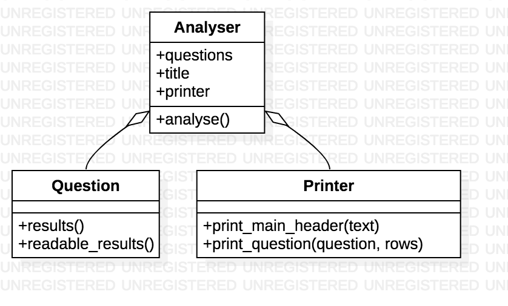

# Logs Analysis

<!-- MarkdownTOC levels="1" autolink=true autoanchor=false bracket="round" -->

- [Install and analyse](#install-and-analyse)
- [How it works](#how-it-works)
- [ERD](#erd)
- [Class diagramm](#class-diagramm)
- [Example output](#example-output)

<!-- /MarkdownTOC -->

## Install and analyse

```sh
git clone git@github.com:elioschmutz/nd004_logs_analysis.git
python nd004_logs_analysis
```

## How it works

The main class is the `Analyser` class. You can append `Question` objects
on it and then run the `analyse` method to start the analysing process.

## ERD



## Class diagramm



## Example output

[Show example output](./docs/example_output.txt)
